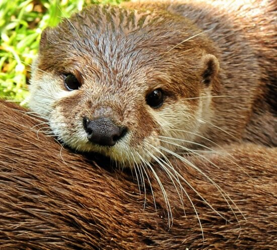

## My Favorite Animal...

_...Is the otter!_

They are very cute :D  
Heres a cool fact about them:

> "Otters are carnivorous mammals in the subfamily Lutrinae. The 13 extant otter species are all semiaquatic, aquatic, or marine, with diets based on fish and invertebrates. Lutrinae is a branch of the Mustelidae family, which also includes weasels, badgers, mink, and wolverines, among other animals." - (_[Wikipedia](https://en.wikipedia.org/wiki/Otter)_)

  

[Go Back](README.md)
