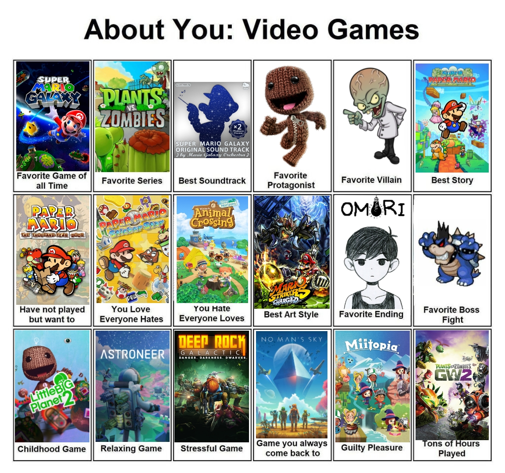

## My favorite game is Super Mario Galaxy for the Nintendo Wii.

"_Old school?_" Well, yeah, but it's the game that well- got me into games, really.
As far as _masterpieces_ go, I have never seen a 3D platformer ever top this one. 
I don't really think there's ever been anything that came as close, to be honest.
I suppose an honorable mention will go to **Plants vs. Zombies: Garden Warfare 2** if I had to (_for shooters anyway_), but honestly- my top 10 changes all the time.

No, really. It's a constantly changing mess. that being said, incase you're curious heres a chart I put together recently (_it's not 100% accurate but it's close_)

